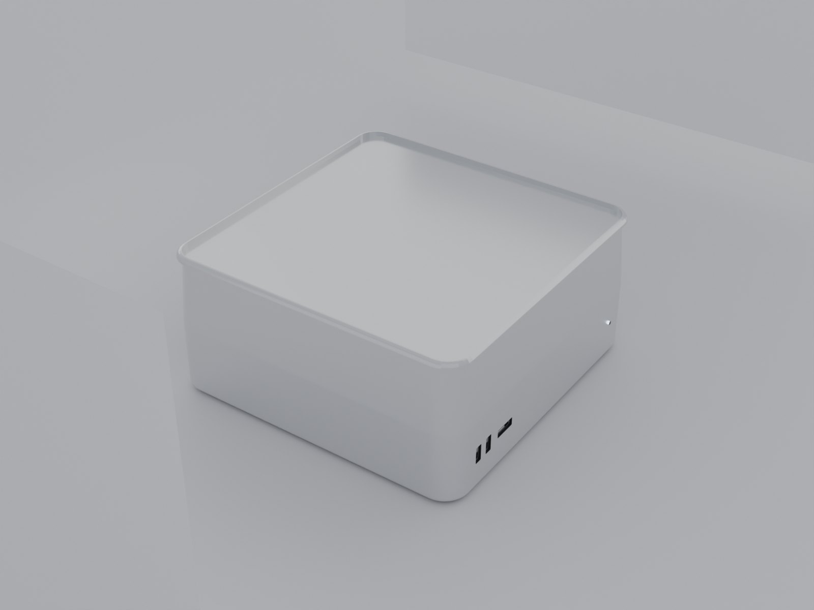

# Mac Studio — 1:1 Blender Model

A dimensionally exact, procedurally generated model of the current-generation
aluminium **Mac Studio**, built with Blender's Python API (`bpy`) and driven
headlessly.

**Live site:** <https://eastspire.github.io/mac-studio-model/>
**Interactive viewer:** <https://eastspire.github.io/mac-studio-model/viewer.html>



## Verified dimensions

Measured from the evaluated mesh (all modifiers applied), against Apple's
published tech specs.

| Axis | Official | Model | Δ |
|------|---------:|------:|---:|
| Width (X)  | 19.70 cm (7.7 in) | 19.7000 cm | **+0.000 mm** |
| Depth (Y)  | 19.70 cm (7.7 in) | 19.7000 cm | **+0.000 mm** |
| Height (Z) | 9.50 cm (3.7 in)  | 9.5000 cm  | **+0.000 mm** |

Height is the full 3.7 in **including the rubber feet** — the enclosure shell
is 9.30 cm and the feet add 0.20 cm.

**Source of truth:** <https://www.apple.com/mac-studio/specs/> — fetched
2026-09-27, "Size and Weight" section. (Apple's older support page ID
`121559` now 404s.)

Reproduce the measurement:

```bash
/Applications/Blender.app/Contents/MacOS/Blender --background \
  --python blender/verify.py          # prints VERIFY_OK / VERIFY_FAIL
```

## What the model contains

Matched against Apple's own product photography, not from memory:

- **Enclosure** — anodised silver aluminium, 1.6 cm vertical corner radius,
  0.35 cm top/bottom edge break.
- **Front** — smooth, uninterrupted silver. Two **vertical** USB-C ports and a
  horizontal SDXC slot, grouped low on the left; status LED low on the right.
  Every opening is a real boolean recess with a socket built wall-by-wall
  (bright metal walls, shadowed back plate, contact tongue).
- **Rear** — recessed connector bay (0.85 cm deep) holding, left to right as
  you face the back of the machine: 4× Thunderbolt 5 (USB-C), 10Gb Ethernet
  (RJ-45), power inlet, 2× USB-A, HDMI 2.1, 3.5 mm headphone jack. Order and
  membership follow Apple's "Take a Tour of Mac Studio" guide.
- **Underside** — a shallow **perforated band around the lower perimeter**
  (1.6 cm tall on a 9.5 cm body, ~17%), with small round holes in staggered
  rows and a solid lip below it. Genuine geometry: 1,253 individual tube
  meshes, not a texture. Plus four rubber feet and the Touch ID power button.
- **Top / sides** — plain, with no logo, text, or vents. The current enclosure
  has no top marking; the 2014–2020 shell carried an Apple logo.

Materials: Principled BSDF throughout — silver `Metallic 1.0 / Roughness 0.19`,
dark anodised grille, matte black cavity, rubber feet, emissive status LED.

## Layout

```
blender/
  build_mac_studio.py   geometry + materials + studio lighting, writes the .blend
  render_views.py       loads the .blend, frames and renders 8 views
  export_gltf.py        exports the .blend to Draco-compressed GLB for the viewer
  verify.py             dimension check -> VERIFY_OK / VERIFY_FAIL
  inspect_bbox.py       per-object bounds report
  bool_sweep.py         boolean-solver parameter probe (diagnostic)
  cut_trace.py          per-cut bbox trace (diagnostic)
  rear_trace.py         rear-bay cut trace (diagnostic)
  build_trace.py        full-build stage trace (diagnostic)
docs/                   GitHub Pages site (published from /docs)
  index.html            project page: dimensions, gallery, gotchas
  viewer.html           interactive WebGL viewer (three.js)
  viewer.js             orbit nav, clipping planes, live PBR controls
  viewer.css
  style.css
  mac-studio.glb        0.40 MB Draco GLB, 84 meshes / 51,840 tris, real scale
  images/               8 renders, web-optimised (1600px progressive JPEG)
  thumbs/               720px gallery thumbnails
mac_studio.blend        generated; not committed (see .gitignore)
renders/                12 MB of full-resolution PNG; not committed
reference/              Apple photos used for the fidelity check; not committed
```

The repo is ~1.2 MB. The 12 MB of full-resolution Cycles PNGs, the 3.4 MB
`.blend`, and the Apple reference photos are all gitignored — regenerate them
with the commands below.

## Interactive viewer

<https://eastspire.github.io/mac-studio-model/viewer.html>

A three.js viewer over the exported geometry, for inspecting the model rather
than just looking at renders:

- **Orbit / zoom / pan**, with 8 named camera views (keys `1`–`8`)
- **Clipping planes** on X, Y, or Z — slice the body open to inspect the port
  cavities and the underside grille from the inside
- **Per-part visibility** for the grille, connectors, and feet, plus a
  wireframe overlay
- **Live PBR controls** for roughness, metalness, environment intensity, and
  tone-mapping exposure

The GLB is authored in **metres** (Blender centimetres × 0.01), so the model is
at true real-world scale in the viewer. Draco compression takes it from 9.1 MB
to 0.40 MB; `viewer.js` loads the decoder from a CDN.

Rebuild the GLB after any geometry change:

```bash
blender --background --python blender/export_gltf.py
npx gltf-pipeline -i docs/mac-studio.glb -o docs/mac-studio.draco.glb -d
mv docs/mac-studio.draco.glb docs/mac-studio.glb
```

## Reproducing

```bash
# geometry + .blend + bbox report
/Applications/Blender.app/Contents/MacOS/Blender --background \
  --python blender/build_mac_studio.py

# 8 views into renders/ (arg 1 = output dir, arg 2 = samples)
/Applications/Blender.app/Contents/MacOS/Blender --background \
  --python blender/render_views.py -- renders 96
```

Camera distance is derived from the model's bounding sphere and the lens FOV,
so re-framing survives geometry edits — no hand-tuned distance constants.

## Rendered views

| File | View |
|------|------|
| `01_front.png` | front elevation |
| `02_side.png` | side profile |
| `03_rear.png` | rear |
| `04_hero.png` | 3/4 hero |
| `05_top.png` | top-down |
| `06_bottom.png` | underside (grille, feet, power button) |
| `07_front_closeup.png` | front panel close-up |
| `08_rear_closeup.png` | rear connector bay close-up |

## Blender gotchas hit while building this

Recorded because each one produced a *plausible-looking* wrong result rather
than an error.

1. **Non-planar n-gon caps break the EXACT boolean solver.** The lofted shell's
   top and bottom caps are large non-planar n-gons. Booleans against it
   "succeed" but silently merge the *cutter's* outer half into the shell, so
   the bounding box **grows by the cutter's overhang**. Triangulating the body
   first (`cut_from_body` → `triangulate_caps`) fixes it. Guard the
   triangulation on `len(p.vertices) == 3` over polygons — `data.loop_triangles`
   is a lazily-filled cache and its length is not a valid "already triangulated"
   test.
2. **A cutter must straddle the skin.** The convention used here: outer face
   0.10 cm proud of the panel (discarded), inner face 0.50 cm in. A cutter that
   does not clearly cross the surface does not produce a recess.
3. **Keep the cutter's bevel small relative to its depth.** A 0.16 cm bevel on
   a 0.60 cm-deep cutter rounds away the part overlapping the skin and
   reproduces the absorption in (1). 0.06 cm works.
4. **Boolean result is direction-sensitive.** A socket helper that hard-codes
   "body extends toward −Y" silently builds front-panel sockets *outside* the
   enclosure. The `inward` parameter makes the axis explicit at every call site.
5. **Auto-smooth needs edge subdivision.** A flat panel lofted as one huge quad
   shades with visible banding. `rounded_rect(..., edge_sub=4)` splits every
   straight edge.
6. **Blender 4.x renamed smooth-shading APIs** — `shade_auto_smooth` (4.2+) /
   `shade_smooth_by_angle` (4.1); `mesh.use_auto_smooth` is gone.
7. **BSDF socket renames in 4.x** — `Clearcoat`→`Coat Weight`,
   `Transmission`→`Transmission Weight`. Print `bsdf.inputs.keys()` first.
8. **A bevel wider than half the shortest side self-intersects**; clamp it.
9. **At roughness 0.19 the shell is a mirror** — bare area lights give it
   nothing to reflect, so the bounce cards are load-bearing, not decoration.
10. **Bounce cards and the floor must be excluded from bbox measurement** or
    they swamp the product bounds (a 40 cm card next to a 19.7 cm product).
11. **A rounded-rect path's corner ARC CENTRES are inset by the radius.** For a
    rectangle of half-extent `hx` with corner radius `r`, the corner circle is
    centred at `(hx - r, 0)` — not `(hx, 0)`. Using the edge midpoint as the
    centre pushes the entire path `r` outward and inflates the bbox by exactly
    that amount, which is maddening to spot in a render.
12. **Never Solidify an open per-hole ring to make a perforation.** Solidify
    offsets along the surface normal, which points outward on a ring laid on a
    vertical face, and the mesh ends up ~1.5 cm proud of the skin. Build each
    hole as a closed tube instead.
13. **Budget a perforated band's Z extent before placing holes.** Tube depth
    plus row spacing must fit between the foot line and the band top, or the
    lowest holes drop below the feet and Z grows by the overshoot.
14. **A boolean groove needs a cutter that straddles the skin — and two of the
    three ways to get that wrong are silent.** A cutter *tangent* to the shell
    and a cutter *buried inside* it both produce no cut at all; only a cutter
    *proud* of the skin is loud, and it leaves the difference behind as new
    geometry that inflates the bounding box by the overshoot (measured: +1.16 mm
    at `proud=0.04`). Worse, the quiet failures still pass `verify.py` — the
    bounding box is unchanged and nothing else looks wrong. Model the recess
    into the loft itself (`grille_inset`) and the question never comes up.
15. **EXACT silently no-ops on open and degenerate cutters.** A ring prism with
    no end caps is an open surface; sample its path every 8th point and the
    faces are so thin the solver treats the solid as degenerate. Both leave the
    vertex count unchanged and the boolean "succeeding". Cap all four rings and
    sample densely.
16. **Ray-cast to check a cut, don't look at the render.** A 300×200 offscreen
    render of the band plus a `scene.ray_cast` sweep across its height is what
    finally located this class of bug: the band read as smooth metal for a
    dozen render iterations, and a ray sweep showed the front face at a constant
    y=-9.850 the whole way down. After the fix the same sweep alternates
    between the groove floor and the hole barrels, and the render goes from
    0.00% dark pixels to 30%.

## Known deviations

- **Port micro-detail.** Connector internals (pin pitch, latch cutouts,
  SDXC contact rows) are represented, not reproduced. A production asset would
  use a manufacturer CAD import.
- **Grille perforation pitch** is 3 mm, chosen to read at render scale; the
  real perforation is finer.
- **Finish.** Machining anisotropy, the fine bead-blast texture, and the exact
  anodised tone are approximated with a single isotropic roughness value.
- **No Apple logo or silkscreen.** The current enclosure has none; the earlier
  (2014–2020) shell did.
- **Colour management** is left at Blender's default Filmic/AgX view transform
  rather than being matched against a calibrated reference.
